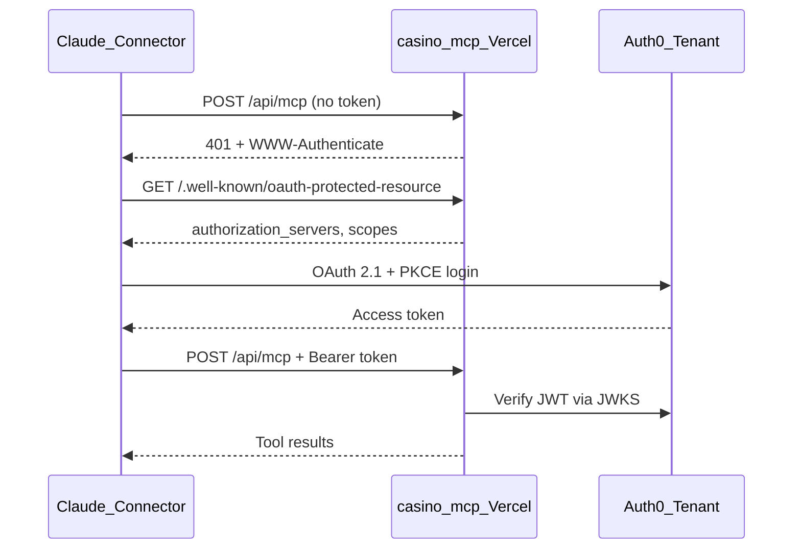

# Auth0 OAuth for Casino Kings MCP

## Goal

Secure the remote MCP server with **Auth0 OAuth 2.1** instead of a shared static bearer secret, while keeping the existing endpoint at `/api/mcp` and all 5 casino tools unchanged.

## Architecture



**Roles:**
- **Auth0** = authorization server (login, consent, token issuance)
- **Your Next.js app** = OAuth resource server (PRM discovery + JWT validation only)
- **`CASINO_API_TOKEN`** = unchanged; still used server-side for upstream PHP API calls

## Reference implementation

Follow Auth0's official Next.js sample: [auth0-ai-samples/auth-for-mcp/nextjs-mcp-js](https://github.com/auth0-samples/auth0-ai-samples/tree/main/auth-for-mcp/nextjs-mcp-js)

Key differences for this repo:
- Keep route at [`app/api/mcp/route.ts`](app/api/mcp/route.ts) (not `/mcp`)
- Use **authentication-only** (no per-tool RBAC scopes)
- Drop `MCP_BEARER_TOKEN` entirely

## Code changes

### 1. Update dependencies in [`package.json`](package.json)

| Action | Package |
|---|---|
| Remove | `@vercel/mcp-adapter` |
| Add | `mcp-handler` (successor package with `withMcpAuth`) |
| Add | `@auth0/auth0-api-js` (JWT verification + PRM builder) |
| Bump | `@modelcontextprotocol/sdk` to a recent 1.x (sample uses `^1.0.0`; align with `mcp-handler` peer deps) |

### 2. Add shared config module

Create [`lib/config.ts`](lib/config.ts):

```typescript
export const AUTH0_DOMAIN = process.env.AUTH0_DOMAIN;
export const AUTH0_AUDIENCE = process.env.AUTH0_AUDIENCE;
export const MCP_SERVER_URL = process.env.MCP_SERVER_URL;
export const AUTH_ENABLED = Boolean(AUTH0_DOMAIN && AUTH0_AUDIENCE && MCP_SERVER_URL);
```

- `AUTH0_AUDIENCE` and `MCP_SERVER_URL` should both be the canonical MCP URL, e.g. `https://<project>.vercel.app/api/mcp`
- `AUTH_ENABLED` allows local dev without Auth0 configured (open server, same as today when `MCP_BEARER_TOKEN` is unset)

### 3. Add Auth0 token verifier

Create [`lib/auth0.ts`](lib/auth0.ts) modeled on the Auth0 sample's `auth0.ts`:

- Use `ApiClient` from `@auth0/auth0-api-js` to verify access tokens against Auth0 JWKS
- Return `AuthInfo` (`token`, `clientId`, `scopes`, `extra.sub/email`) for `withMcpAuth`
- No per-tool `requireScopes` wrapper needed for v1

### 4. Refactor MCP route

Update [`app/api/mcp/route.ts`](app/api/mcp/route.ts):

- Change import: `createMcpHandler` from `mcp-handler` (not `@vercel/mcp-adapter`)
- Remove `MCP_BEARER` and manual `authWrap`
- Wrap handler with `withMcpAuth`:

```typescript
const authHandler = withMcpAuth(
  handler,
  async (_req, token) => (token ? auth0Mcp.verify(token) : undefined),
  {
    required: AUTH_ENABLED,
    resourceMetadataPath: "/.well-known/oauth-protected-resource",
  }
);
export { authHandler as GET, authHandler as POST, authHandler as DELETE };
```

- Leave all 5 tool handlers and upstream `CASINO_API_TOKEN` fetch logic untouched

### 5. Add OAuth discovery endpoints

Create [`app/.well-known/oauth-protected-resource/route.ts`](app/.well-known/oauth-protected-resource/route.ts):

- Use `ProtectedResourceMetadataBuilder` from `@auth0/auth0-api-js`
- Point `authorization_servers` at `https://<AUTH0_DOMAIN>/`
- Advertise a single scope: `mcp:tools` (or omit scope enforcement server-side since v1 is auth-only)
- Export `GET` + `OPTIONS` with CORS headers (match Auth0 sample)

Optionally add [`app/.well-known/oauth-authorization-server/route.ts`](app/.well-known/oauth-authorization-server/route.ts) as a proxy to Auth0's AS metadata for clients that probe that path (Auth0 sample includes this).

### 6. Update env and docs

Update [`.env.example`](.env.example):

```bash
CASINO_API_TOKEN=your-token-here

# Auth0 (optional locally; required in production)
AUTH0_DOMAIN=your-tenant.us.auth0.com
AUTH0_AUDIENCE=https://your-project.vercel.app/api/mcp
MCP_SERVER_URL=https://your-project.vercel.app/api/mcp
```

Remove `MCP_BEARER_TOKEN`.

Update [`README.md`](README.md) with:
- Auth0 tenant setup steps (below)
- New Vercel env vars
- Claude connector setup (URL only; OAuth flow is automatic)

### 7. Vercel config

Update [`vercel.json`](vercel.json) if needed to ensure the `.well-known` route is not blocked and has adequate timeout (same as MCP route).

## Auth0 tenant setup (manual, before production)

You do this in the Auth0 dashboard (or Auth0 CLI). Full guide: [Auth0 Tenant Setup](https://github.com/auth0-samples/auth0-ai-samples/blob/main/auth-for-mcp/fastmcp-mcp-js/README.md#auth0-tenant-setup).

**Minimum steps:**

1. **Enable Resource Parameter Compatibility Profile** — required for MCP RFC 8707 `resource` parameter ([Auth0 guide](https://auth0.com/ai/docs/mcp/guides/resource-param-compatibility-profile))

2. **Enable tenant flags** for Claude auto-registration:
   - `client_id_metadata_document_supported`
   - `enable_dynamic_client_registration`
   - `use_scope_descriptions_for_consent`

3. **Create an API (Resource Server)**
   - Identifier: `https://<your-project>.vercel.app/api/mcp` (must match `AUTH0_AUDIENCE` / `MCP_SERVER_URL`)
   - Signing: RS256
   - Add one scope: `mcp:tools` (for consent screen; server won't enforce per-tool scopes in v1)

4. **Promote login connections to domain-level** so third-party clients (Claude) can use them

5. **Create users** (or enable a connection like Google/email) who should access the connector

6. **Optional but recommended for production:** pre-register a Claude OAuth app in Auth0 and add Client ID/Secret in Claude connector Advanced settings, instead of relying solely on DCR

## Claude connector setup

1. Settings → Connectors → Add custom connector
2. URL: `https://<project>.vercel.app/api/mcp`
3. No static bearer token needed
4. On first use, Claude opens Auth0 login; after consent, tools work automatically

## Local development

| `AUTH0_*` env vars | Behavior |
|---|---|
| Not set | Open server (same as current dev without `MCP_BEARER_TOKEN`) |
| Set | Auth required; test with MCP Inspector + Auth0 test token |

**Test PRM endpoint:**
```bash
curl http://localhost:3000/.well-known/oauth-protected-resource
```

## Out of scope (v1)

- Per-tool RBAC scopes and Auth0 roles
- Custom Token Exchange for upstream `CASINO_API_TOKEN` (upstream token stays server-side)
- Lazy/mixed auth (public + protected tools)
- Auth0 login UI in the Next.js app itself

## Verification checklist

- `GET /.well-known/oauth-protected-resource` returns JSON with Auth0 issuer
- Unauthenticated `POST /api/mcp` returns 401 with `WWW-Authenticate` header
- Authenticated request with valid Auth0 token lists all 5 tools
- `CASINO_API_TOKEN` still works for upstream API calls
- Claude connector completes OAuth popup and can call tools
