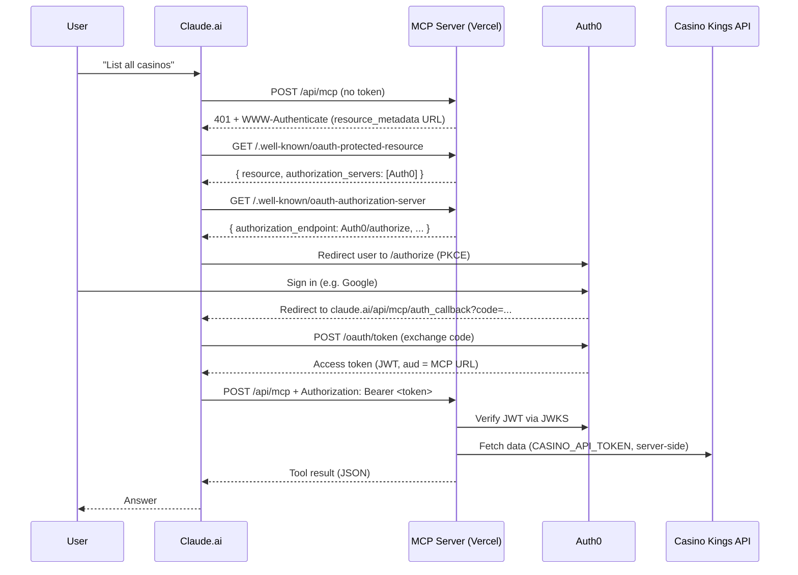

# MCP + Auth0 + Claude — Setup Documentation

This document describes how the Casino Kings MCP server is secured with Auth0 OAuth, how the pieces connect, and what was configured to make Claude custom connectors work.

## Architecture overview



### Roles of each component

| Component | Role |
|---|---|
| **Claude.ai** | MCP client. Discovers OAuth metadata, runs login, stores tokens, calls tools. |
| **MCP server** (`casinos-mcp.vercel.app`) | Protected resource. Exposes tools + OAuth discovery endpoints. Validates JWTs. Proxies upstream API. |
| **Auth0** | Authorization server. Handles login, consent, token issuance. |
| **Casino Kings API** | Upstream data source. Called only by the MCP server using `CASINO_API_TOKEN` (never exposed to Claude or users). |

---

## Production URLs and identifiers

| Item | Value |
|---|---|
| MCP endpoint | `https://casinos-mcp.vercel.app/api/mcp` |
| Protected resource metadata | `https://casinos-mcp.vercel.app/.well-known/oauth-protected-resource` |
| Authorization server metadata (proxy) | `https://casinos-mcp.vercel.app/.well-known/oauth-authorization-server` |
| Auth0 API identifier (`AUTH0_AUDIENCE`) | `https://casinos-mcp.vercel.app/api/mcp` |
| Auth0 tenant domain (`AUTH0_DOMAIN`) | `your-tenant.us.auth0.com` (copy exactly from Auth0 dashboard) |
| Claude OAuth callback | `https://claude.ai/api/mcp/auth_callback` |

`AUTH0_AUDIENCE`, `MCP_SERVER_URL`, and the Auth0 API identifier must all match exactly.

---

## What we configured

### 1. Vercel (MCP server hosting)

Environment variables in **Vercel → Project → Settings → Environment Variables**:

| Variable | Purpose |
|---|---|
| `CASINO_API_TOKEN` | Server-side token for bitcoincasinokings.com internal API |
| `AUTH0_DOMAIN` | Auth0 tenant hostname (no `https://`) |
| `AUTH0_AUDIENCE` | Auth0 API identifier = MCP URL |
| `MCP_SERVER_URL` | Canonical MCP URL (same as `AUTH0_AUDIENCE`) |

Redeploy after changing env vars.

The app is a Next.js project deployed from GitHub (`affteamgit/casinos-mcp`). Key routes:

- `app/api/mcp/route.ts` — MCP tools + `withMcpAuth` JWT gate
- `app/.well-known/oauth-protected-resource/route.ts` — tells Claude where Auth0 is
- `app/.well-known/oauth-authorization-server/route.ts` — returns Auth0 OAuth endpoints (static, see below)
- `lib/auth0.ts` — JWT verification via `@auth0/auth0-api-js`
- `lib/config.ts` — env config; auth enabled when all three Auth0 vars are set

### 2. Auth0 tenant settings (Advanced)

Enabled under **Settings → Advanced**:

| Setting | Status | Why |
|---|---|---|
| Resource Parameter Compatibility Profile | On | MCP clients send RFC 8707 `resource` parameter |
| Dynamic Client Registration (DCR) | On | Allows Claude auto-registration (we ended up using manual app instead) |
| Client ID Metadata Document (CIMD) Registration | On | MCP client registration support |

`use_scope_descriptions_for_consent` is optional (cosmetic consent screen only; not in dashboard UI — set via Management API if desired).

### 3. Auth0 API (Resource Server)

**Applications → APIs → Create API**

| Field | Value |
|---|---|
| Name | `casino data` |
| Identifier | `https://casinos-mcp.vercel.app/api/mcp` |
| Signing Algorithm | RS256 |
| JWT Profile | Auth0 (or RFC 9068 if Claude token validation issues arise) |

**Permissions tab** — added scope:

| Scope | Description (optional) |
|---|---|
| `mcp:tools` | Access Casino Kings MCP tools |

**Application Access tab** — authorized the manually created Claude app with `mcp:tools` (User-Delegated Access).

### 4. Auth0 connections (login methods)

Promoted login connections to **domain-level** so third-party OAuth clients (Claude) can use them:

**Authentication → Social → Google** (and/or Database connection) → Settings → **Promote Connection to Domain Level** → Save.

With Google enabled, users do **not** need to be pre-created in Auth0. First Google login auto-creates their Auth0 user.

### 5. Auth0 application for Claude (manual OAuth client)

DCR did not work reliably in our setup, so we **pre-registered** a Claude OAuth app.

**Applications → Create Application**

| Field | Value |
|---|---|
| Name | `Claude` |
| Type | Regular Web Application |

**Settings:**

| Field | Value |
|---|---|
| Allowed Callback URLs | `https://claude.ai/api/mcp/auth_callback` |
| Allowed Web Origins | `https://claude.ai` |

**APIs tab** — authorize **casino data** API with `mcp:tools` scope.

Copy **Client ID** and **Client Secret** — these are shared with anyone who should add the connector in Claude (treat as sensitive).

### 6. Code fix: authorization server metadata

**Problem:** The original `oauth-authorization-server` route called Auth0 at runtime via `discoverAuthorizationServerMetadata()`. This could time out on Vercel (10s function limit), causing Claude to fall back to `https://casinos-mcp.vercel.app/authorize` → 404.

**Fix:** Return static metadata pointing directly at Auth0 endpoints. See `app/.well-known/oauth-authorization-server/route.ts`.

**Also critical:** `AUTH0_DOMAIN` must be the **exact** tenant domain from the Auth0 dashboard. A typo (e.g. wrong character in the subdomain) causes `Unknown host` DNS errors and the same `/authorize` 404 fallback.

---

## MCP tools exposed

| Tool | Description |
|---|---|
| `list_casinos` | All casinos as `{casino_id, brand_name}` |
| `find_casino_by_name` | Partial case-insensitive name search |
| `get_casino_data` | Full data for one or more casino IDs |
| `get_casino_by_name` | Name → full data in one call |
| `live_bonuses` | Active bonuses snapshot (WordPress API) |

---

## How a user connects in Claude

### What the admin shares

1. Connector URL: `https://casinos-mcp.vercel.app/api/mcp`
2. OAuth Client ID (from Auth0 Claude app)
3. OAuth Client Secret (from Auth0 Claude app)

Share these only with people who should have access.

### What the user does

1. **claude.ai → Settings → Connectors → Add custom connector**
2. Name: e.g. `Casino Kings`
3. URL: `https://casinos-mcp.vercel.app/api/mcp`
4. **Advanced settings** → paste Client ID and Client Secret
5. Click **Add**
6. In a chat, enable the connector
7. On first use, complete Auth0 login (e.g. Google) and approve consent

No Vercel or Auth0 dashboard access required for end users.

---

## Access control model

### What secures access

| Layer | What it controls |
|---|---|
| **Client ID + Secret** | Who can *configure* the connector in Claude. Shared credentials — treat like an API key. |
| **Auth0 login (Google)** | Who the person is. With Google, any Google account can sign in on first use (no pre-invite needed). |
| **JWT validation on MCP server** | Every tool request must carry a valid Auth0 access token with correct `aud` (API identifier). |
| **`CASINO_API_TOKEN`** | Upstream API access. Server-side only; never sent to Claude or users. |

### What does NOT gate access (in current setup)

- No per-user allowlist in MCP server code — any authenticated Auth0 user with a valid token can use all tools.
- No requirement to pre-create Auth0 users when using Google login.

### Tightening access (future options)

- Stop sharing Client ID/Secret broadly
- Restrict Google to a company domain (Google Workspace + Auth0 rules)
- Switch to invite-only email/password (disable sign-ups, create users manually)
- Add email allowlisting in `lib/auth0.ts` after token verification

---

## Verification commands

Run after deploy or config changes:

```bash
# 1. Protected resource metadata (should return JSON with authorization_servers)
curl -s https://casinos-mcp.vercel.app/.well-known/oauth-protected-resource

# 2. Authorization server metadata (should return Auth0 authorization_endpoint)
curl -s https://casinos-mcp.vercel.app/.well-known/oauth-authorization-server

# 3. Unauthenticated MCP call (should return 401 with WWW-Authenticate header)
curl -sS -D - -o /dev/null -X POST https://casinos-mcp.vercel.app/api/mcp \
  -H "Content-Type: application/json" \
  -H "Accept: application/json, text/event-stream" \
  -d '{"jsonrpc":"2.0","id":1,"method":"initialize","params":{"protocolVersion":"2025-06-18","capabilities":{},"clientInfo":{"name":"test","version":"1"}}}'

# 4. Verify Auth0 domain resolves (replace with your exact domain)
curl -s -o /dev/null -w "%{http_code}\n" https://YOUR-TENANT.us.auth0.com/.well-known/openid-configuration
# Expected: 200
```

Expected `WWW-Authenticate` header on 401:

```
www-authenticate: Bearer error="invalid_token", error_description="No authorization provided",
  resource_metadata="https://casinos-mcp.vercel.app/.well-known/oauth-protected-resource"
```

---

## Troubleshooting we hit

| Symptom | Cause | Fix |
|---|---|---|
| `Couldn't register with sign-in service` | DCR failed; no manual OAuth app | Pre-register Claude app; add Client ID/Secret in connector |
| 404 on `casinos-mcp.vercel.app/authorize` | Claude couldn't discover Auth0 endpoints | Fix `oauth-authorization-server` route (static metadata); verify `AUTH0_DOMAIN` is correct |
| `Unknown host` for Auth0 domain | Typo in `AUTH0_DOMAIN` env var | Copy domain exactly from Auth0 dashboard; redeploy |
| Connector works for admin but unclear who else can connect | Google login auto-creates users | Access = whoever has Client ID/Secret + can complete Google OAuth |
| `invalid_redirect_uri` | Wrong callback URL on Auth0 app | Must be exactly `https://claude.ai/api/mcp/auth_callback` |
| Tools not loading / 401 after login | API not authorized for Claude app | APIs → casino data → Application Access → Claude → grant `mcp:tools` |

---

## Request flow (authenticated)

1. Claude sends `POST /api/mcp` with `Authorization: Bearer <jwt>`.
2. `withMcpAuth` (from `mcp-handler`) extracts the token.
3. `auth0Mcp.verify()` validates JWT against Auth0 JWKS; checks `aud` matches `AUTH0_AUDIENCE`.
4. On success, tool handler runs and fetches upstream data with `CASINO_API_TOKEN`.
5. Result returned to Claude as JSON text content.

---

## Secrets summary

| Secret | Where it lives | Who sees it |
|---|---|---|
| `CASINO_API_TOKEN` | Vercel env only | Server only |
| Auth0 Client Secret | Auth0 + shared with connector users | Users adding connector |
| User Google password | Google / Auth0 | Individual user only |
| Auth0 access token | Claude (cached per user) | Per-user session |

---

## Related files

| File | Purpose |
|---|---|
| `app/api/mcp/route.ts` | MCP tool definitions + auth wrapper |
| `app/.well-known/oauth-protected-resource/route.ts` | RFC 9728 protected resource metadata |
| `app/.well-known/oauth-authorization-server/route.ts` | OAuth AS metadata proxy (static Auth0 endpoints) |
| `lib/auth0.ts` | JWT verification |
| `lib/config.ts` | Environment configuration |
| `.env.example` | Local env template |
| `vercel.json` | Function timeout (10s) for MCP and well-known routes |
